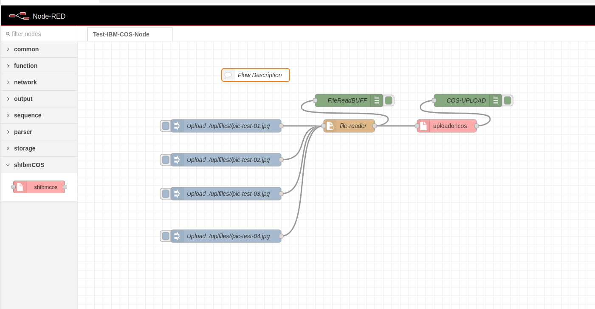
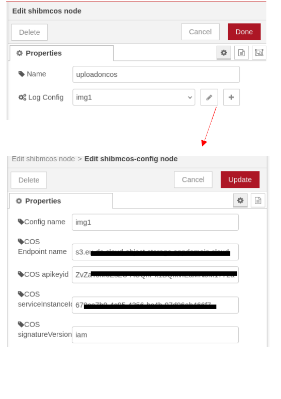
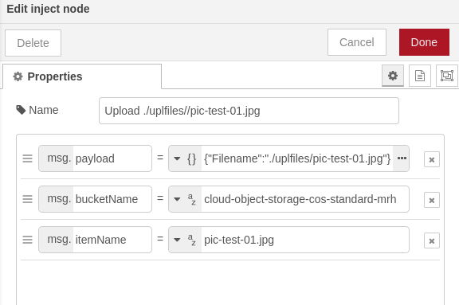

# cos-node-red - Custom Node-Red node which upload large binary files at IBM Cloud Object Storage.

It is a veri simple custom node. It contains config node and classic node.
Before using it you must have: 
- IBM cloud account
- create IBM Cloud Object Storage
- created bucket you want to load files
- you must get proper credentioals for interaction with IBM Cloud Object Storage via API.

The simple test flow is shown on [pic-01](#pic-01)

<kbd></kbd>
<p style="text-align: center;"><a name="pic-01">pic-01</a></p>

Configuration is shown on [pic-02](#pic-02)


<kbd></kbd>
<p style="text-align: center;"><a name="pic-02">pic-02</a></p>

Particular absolute or relative file with path and basketName and itemName in basket must be in massage properties [pic-03](#pic-03):

```js
msg.payload={"Filename":"./uplfiles/pic-test-01.jpg"}
msg.bucketName="basketname"
msg.itemName="file name on COS oin backet"
```


<kbd></kbd>
<p style="text-align: center;"><a name="pic-03">pic-03</a></p>

After successful upload  msg.payload has json:

```json
{
    "ok":true,
    "uploadresult":{
        "bucketName":"cloud-object-storage-cos-standard-xxx",
        "itemName":"pic-test-01.jpg",
        "uploadID":"01000195-5d17-dc00-0000000000000"
    }
}

```


## Directories

- ./ufiles

Files for upoads for testing

- ./shcos

Node Source code

- ./dev 
setffing.js for develpment configurations

- ./doc

Helper for documentation

## Flows

- test_01.json - flow for node testing


## Start Test flow  on laptop

- clone git repo.
- install dependency

```bash
npm install
```

- run node-red application

```bash
 npm run dev

```

Flow will be accessed on http://localhost:1880/


